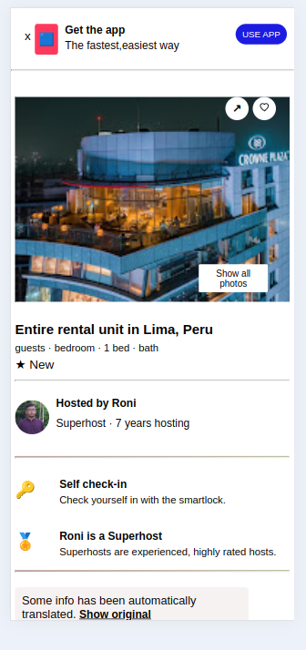

# Airbnb Clone Project
I've built a single page Airbnb clone using HTML, CSS, and JavaScript. It includes features like filtering locations, selecting dates, and choosing the number of guests. There's an image gallery modal and a host view with a beautiful host card. This project shows my skills in creating user-friendly web pages with interactive elements.

## Features
- Responsive View
- Iterative Navigation menu
- Iterative calender
- Beautiful host section
- Proper comment & documentation


### Tools & Technology

This is built using following tools & technologies:

 : HTML (HyperText Markup Language) is the standard language used to create and structure content on the web. It provides the essential framework for web pages, allowing developers to define elements such as headings, paragraphs, images, and links.

 : CSS (Cascading Style Sheets) is used to style and layout web pages, controlling the visual presentation of HTML elements. It allows developers to apply fonts, colors, spacing, and responsive design to enhance user experience.

 : JavaScript is a versatile programming language used for building dynamic and interactive web pages. It enables developers to create engaging user interfaces and enhance the user experience with real-time updates and interactions. With its wide range of libraries and frameworks, JavaScript powers many modern web applications and ensures compatibility across different browsers. 

 : Visual Studio Code, also commonly referred to as VS Code, is a source-code editor developed by Microsoft for Windows, Linux, macOS, and web browsers. Features include support for debugging, syntax highlighting, intelligent code completion, snippets, code refactoring, and embedded version control with Git.
 


### Running the Project
1. <h4>Clone the project</h4>

    ```bash
    git clone https://github.com/Md-Roni024/Airbnb-Clone-Project
    ```  
2. <h4>Navigate to directory and install dependencies</h4>

    ```
    cd Airbnb-Clone-Project
    Open index.html in any browser
    ```

### Screenshot
- Desktop View
  
- Mobile View

 <div style="display: flex; justify-content: space-between;">

  
  
  

</div>

### Future Improvements
  - Add more functionality:

  - I will add some more inteactive functionality where user can give     ratings and review  to every hotels. Also can make report to hotel in any unwanted reason.

  - Notification System :The system notifies rectors instantly upon new complaints within their hostel blocks, facilitating quick response
  - Use SASS for improve CSS quality.


### Contributing

- Contributing is an open invitation for collaboration on the project. You're encouraged to participate by opening issues for bugs or feature requests and submitting pull requests with your improvements or fixes. Your contributions help enhance and grow the project, making it better for everyone.


### Contact

- For any questions or feedback, please reach out to me at roni.cse024@gmail.com. I welcome all inquiries and look forward to hearing from you. Your input is valuable and appreciated!

